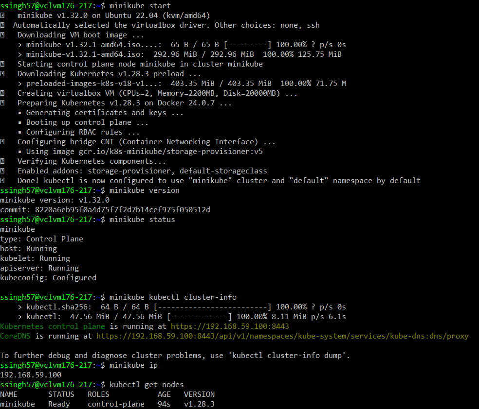
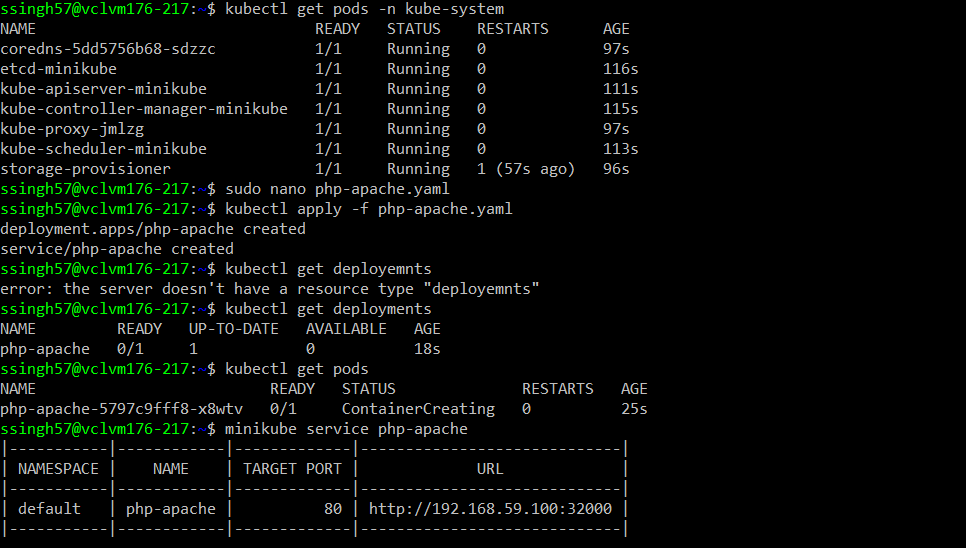
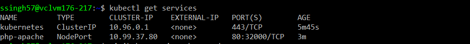
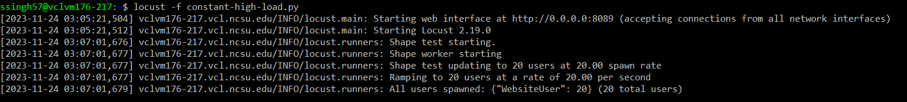
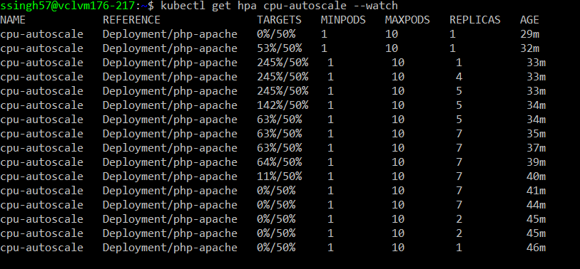
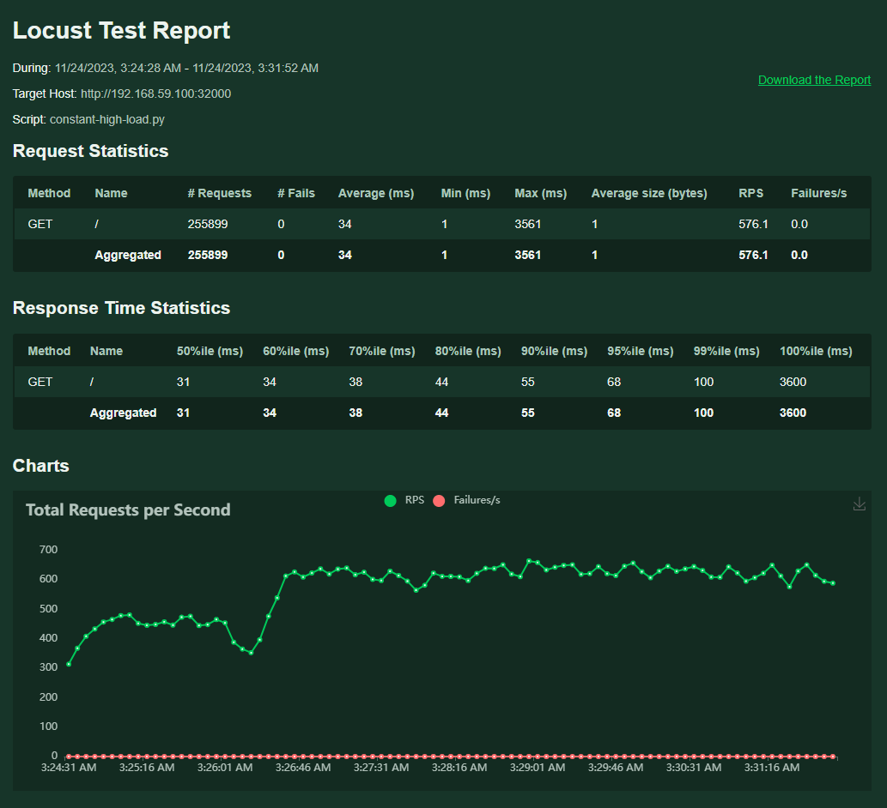
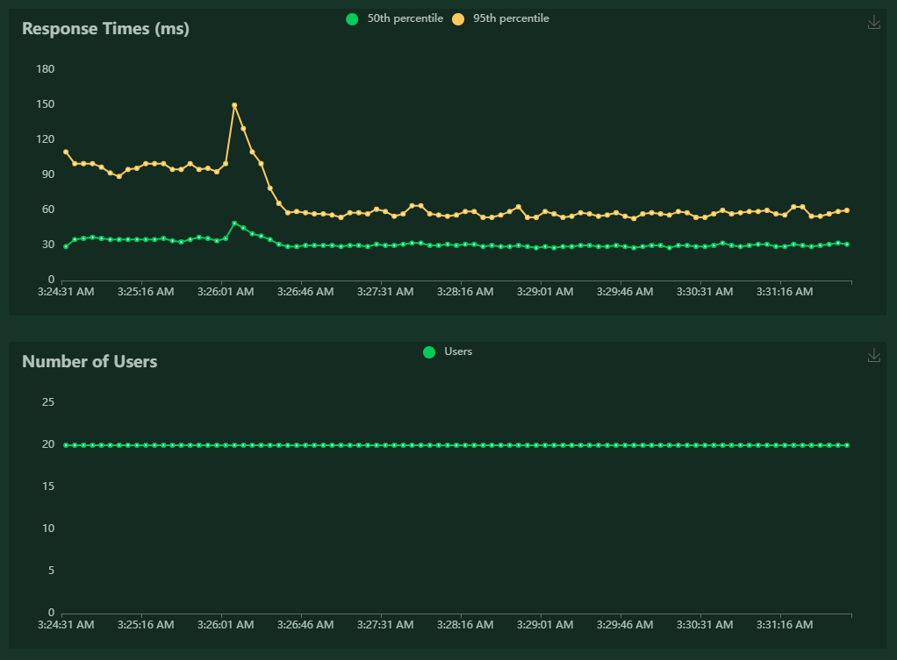

# Kubernetes-Horizontal-Pod-Autoscaling

### Technical Requirement: 
Performance and Reliability

### Experiment Design

The focus is on providing insights into the practical application and performance of Horizontal Pod Autoscaling (HPA) within Kubernetes environments, with a specific emphasis on tenant isolation. 

- **Objective:** Set up auto-scaling policies to handle sudden traffic surges.
- **Technology:** Horizontal Pod Autoscaling (HPA)

#### Experiment Setup:
This segment focuses on Horizontal Pod Autoscaling (HPA) with specific emphasis on managing an Apache server deployment to dynamically scale pods based on CPU utilization.

**Environment and Tooling:**
- Conducted within the Virtual Computing Lab (VCL) at NCSU, using Kubernetes tools such as minikube, kubectl, and VirtualBox.

**Initial Deployment:**
- Deployed an Apache server within a Kubernetes cluster on a single node with an initial configuration of one pod.

**Configuration of HPA:**
- Set up Horizontal Pod Autoscaler to automatically adjust the number of pods to a maximum of 10 based on CPU utilization, aiming to keep it under 50%.

**Load Generation:**
- Utilized Locust to generate controlled loads simulating user traffic on the host.

**Monitoring and Analysis:**
- Via web UI: Analyzed Locust-generated reports to evaluate performance metrics.
- Via kubectl: Monitored the auto-scaling process, tracking changes in CPU utilization over time.

**Visualization and Reporting:**
- Presented findings through charts and graphs illustrating the effectiveness and efficiency of the HPA setup in maintaining CPU usage below the specified threshold while handling variable workloads.
- Setup Snapshots:
  - 
  - 
  - 

### Workload Generation with Locust

#### Steps & Configurations for Generating Workload:

1. Create a Locust vanilla Python file for requests. [15]
2. Run the Locust file with the command: `locust -f constant-high-load.py`.
3. Access the Locust interface at `152.7.176.217:8089`. Port 8089 of the VCL is exposed to accept incoming traffic.
4. Use the Host URL (`http://192.168.59.100:32000`) to simulate workload.
5. Use "Start swarming" to generate a sustained load.

#### Monitoring the Workload:

- **Locust WebUI:**
  - Observe the generated load, user count, total requests per second, and response times within the Locust web interface.

- **Kubectl Monitoring:**
  - Continuously monitor the Horizontal Pod Autoscaler by executing `kubectl get hpa cpu-autoscale --watch`. This command tracks CPU usage and pod scaling in real-time.

- **Running Locust:**
  - 

### Analysis of the Results

#### Watching Autoscale via kubectl:

- **Initial State:**
  - Deployment starts with 1 pod, and CPU utilization is at 0%.

- **Increasing Load:**
  - As the load generated by Locust intensifies, CPU utilization rises significantly, surpassing the specified limit, reaching a maximum of 245%.

- **Horizontal Scaling of Pods:**
  - In response to the increased load, HPA effectively scales the pods horizontally, dynamically adjusting from 1 to 4 to 5 to eventually 7 pods.

- **CPU Utilization Optimization:**
  - With the increased pod count, CPU utilization gradually decreases from 245% to 63%, illustrating the successful distribution of the load across multiple pods.

- **Load Removal Impact:**
  - Once the load from Locust is entirely removed, CPU utilization swiftly drops back to 0%. Pods in the deployment scale down from 7 to 2 and finally settle at 1, demonstrating HPA's effective scaling-down mechanism.

#### Analysis through Locust Reports:

- **Request Volume and Users:**
  - Requests peak at 600 to 700 as approximately 20 users attempt to access the host.
  - User count remains constant at around 20 as per the set configuration.
  - No requests fail during this experimental phase, indicating the successful handling of the increased load by the dynamically scaled pods.

- **Response Time Observations:**
  - Initially, the service experiences high response times, including a peak due to the load.
  - As the pods scale horizontally, the response time gradually decreases, indicating efficient handling of increased workload demands.

#### Conclusion:

- **HPA's Efficacy:**
  - The observed increase in CPU utilization triggering horizontal pod scaling indicates the HPA's responsiveness to varying workloads.

- **Performance Enhancement:**
  - The declining response times despite the increased load highlights the efficiency of horizontal scaling in meeting service demands without compromising response efficiency or request failure rates.

- **Snapshot kubectl:**
  - 

- **Locust report:**
  - 
  - 
